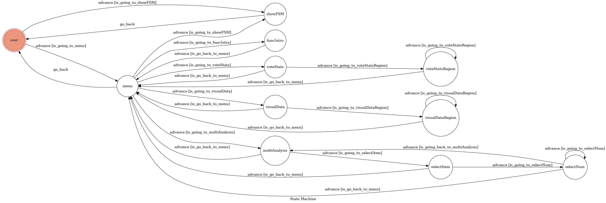

# LineBot-2021TWVoteStats 

## 簡介

- 用於查詢2021年台灣各地區公投結果、產生分層設色圖、以及與村里收入進行複合分析
- `master` 分支為deadline前繳交，與當前`after`分支相比主要多了更多複合分析項目以及更改上傳圖床

## 環境

- WSL 1 : Ubuntu 18.04 LTS
	- 建議將apt sources.list 更換為 `tw.archive.ubuntu.com`
- python 3.6.9
- ngrok

## 使用套件

- requests
	- 爬取中選會網站上的投票數據、上傳圖片至圖床空間
- pandas
    - 以DataFrame型式處理CSV資料
- geopandas
	- 處理.shp的地圖資料，並調用matplotlib.pyplot產生分層設色圖
- matplotlib.pyplot
	- 繪製統計圖表
- mapclassify
	- 處理地圖分層方法
- palettable
	- 調色盤，使用palettable.cmocean.diverging下的Delta此color map，做藍綠對照

## 設置
### Prerequisite
- `graphviz`
```shell
sudo apt-get install graphviz graphviz-dev
```
- `ngrok`
	- WSL (Can't use snap)
	```shell
	wget https://bin.equinox.io/c/4VmDzA7iaHb/ngrok-stable-linux-amd64.tgz
	sudo tar xvzf ngrok-stable-linux-amd64.tgz -C /usr/local/bin
	```
	- Linux
		- Install ngrok via Apt
		```shell
		curl -s https://ngrok-agent.s3.amazonaws.com/ngrok.asc | sudo tee /etc/apt/trusted.gpg.d/ngrok.asc >/dev/null &&
              echo "deb https://ngrok-agent.s3.amazonaws.com buster main" | sudo tee /etc/apt/sources.list.d/ngrok.list &&
              sudo apt update && sudo apt install ngrok
		```
		- Install ngrok via Snap
		```shell
		snap install ngrok
		```

### Install Dependency

1. 安裝 `pipenv`
```shell
pip3 install pipenv
```
2. 產生 `pipenv` 虛擬環境
```shell
pipenv --python 3.6
```
3. 在虛擬環境下安裝套件 (需先安裝graphviz)
```shell
pipenv install
```
4. 將 `.env.sample` 改名為 `.env` ，並填入對應SECRET和TOKEN
- Line
    - LINE_CHANNEL_SECRET
    - LINE_CHANNEL_ACCESS_TOKEN
- ~~SM.MS~~
    - ~~SMMS_API_TOKEN~~

### 安裝中文字體

1. 查看虛擬環境下matplotlib存放目錄

	- 進入pipenv下的python shell
    ```shell
    pipenv run python3
    // Ctrl+D 或 輸入 exit() 退出
    ```
    - 執行python程式碼

    ```python
    import matplotlib
    matplotlib.matplotlib_fname()

    # 輸出範例
    '.../matplotlib/mpl-data/matplotlibrc'
    # 目錄
    '.../matplotlib/mpl-data'
    ```

2. 下載Noto_Sans_TC字體，解壓至./fonts/ttf
```shell
wget -O Noto_Sans_TC.zip https://fonts.google.com/download?family=Noto%20Sans%20TC

unzip Noto_Sans_TC.zip -d {YOUR_FOLDER}/matplotlib/mpl-data/fonts/ttf/
```

3. 再次進入pipenv下的python shell，重新加載字體

```python
from matplotlib.font_manager import _rebuild
_rebuild() 
```

### 執行

1. run `ngrok` to deploy Line Chat Bot locally
```shell
screen -S ngrok
ngrok http 8000 //Ctrl+D to exit
```
2. execute app.py
```shell
pipenv run python3 app.py
```

## Finite State Machine


## Usage

### States
- `user`: 起始點，接收到追蹤訊息後進入`menu`
- `showFSM`: 此階段隱藏，可從`user`和`menu`進入，用於回傳FSM圖
- `menu`: 主選單目錄，可從顯示之選單進入以下4個功能階段，在任何階段輸入含有`menu`或`目錄`的文字可返回目錄
- `voteStats`: 投票數據功能，若輸入合法進入`voteStatsRegion`
	- input: `縣市-鄉鎮市區-村里`，以`-,_ `分隔皆可，允許只輸入`縣市-鄉鎮市區`或`縣市`
	- `voteStatsRegion`: 顯示輸入地區之投票結果，允許再次輸入，或點擊`返回目錄`回到`menu`
- `visualData`: 視覺化數據功能，若輸入合法進入`visualDataRegion`
	- input: `全國` 或 `縣市`，因圖資只到鄉鎮層級，無法產生鄉鎮市區的分層設色圖
	- `visualDataRegion`: 顯示輸入地區之分層設色圖，允許再次輸入，或點擊`返回目錄`回到`menu`
- `multiAnalysis`: 複合分析功能，可根據收入、年齡，進行複合分析，分析項目以選單顯示
	- input: `收入-分析項目` 或 `年齡-分析項目`，選單將呈現主要的項目
	- `selectItem`: 選擇分析項目後允許輸入選取的資料數量，輸入`目錄`回到`menu`
	- input: `整數值`，即分析項目下分析前後多少數量
	- `selectNum`: 根據輸入項目、數量，顯示投票結果與對應資料的複合分析，允許再次輸入分析數量、`重新選擇分析項目`回到`multiAnalysis`、或點擊`返回目錄`回到`menu`
- `funcIntro` : 功能介紹，點擊返回回到`menu`

### QRCode

Line ID : @888qoqdr


### ScreenShots

- 查詢投票數據


- 顯示視覺化資料


- 複合資料分析


- 功能介紹與說明


## Deploy
Setting to deploy webhooks on Heroku.

### Heroku CLI installation

* [macOS, Windows](https://devcenter.heroku.com/articles/heroku-cli)

or you can use Homebrew (MAC)
```sh
brew tap heroku/brew && brew install heroku
```

or you can use Snap (Ubuntu 16+)
```sh
sudo snap install --classic heroku
```

### Connect to Heroku

1. Register Heroku: https://signup.heroku.com

2. Create Heroku project from website

3. CLI Login

	`heroku login`

### Upload project to Heroku

1. Add local project to Heroku project

	heroku git:remote -a {HEROKU_APP_NAME}

2. Upload project

	```
	git add .
	git commit -m "Add code"
	git push -f heroku master
	```

3. Set Environment - Line Messaging API Secret Keys

	```
	heroku config:set LINE_CHANNEL_SECRET=your_line_channel_secret
	heroku config:set LINE_CHANNEL_ACCESS_TOKEN=your_line_channel_access_token
	```

4. Your Project is now running on Heroku!

	url: `{HEROKU_APP_NAME}.herokuapp.com/callback`

	debug command: `heroku logs --tail --app {HEROKU_APP_NAME}`

5. If fail with `pygraphviz` install errors

	run commands below can solve the problems
	```
	heroku buildpacks:set heroku/python
	heroku buildpacks:add --index 1 heroku-community/apt
	```

	refference: https://hackmd.io/@ccw/B1Xw7E8kN?type=view#Q2-如何在-Heroku-使用-pygraphviz

## Reference
[Pipenv](https://medium.com/@chihsuan/pipenv-更簡單-更快速的-python-套件管理工具-135a47e504f4) ❤️ [@chihsuan](https://github.com/chihsuan)

[TOC-Project-2019](https://github.com/winonecheng/TOC-Project-2019) ❤️ [@winonecheng](https://github.com/winonecheng)

Flask Architecture ❤️ [@Sirius207](https://github.com/Sirius207)

[Line line-bot-sdk-python](https://github.com/line/line-bot-sdk-python/tree/master/examples/flask-echo)
